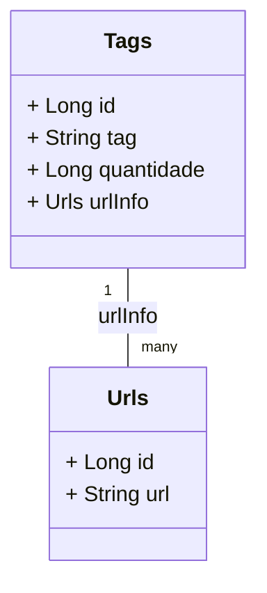

<h1 align="center"> Nuti-desafio-tags</h1>

<h2>Visao geral do Projeto:</h2>
<h3>Formulario de busca</h3>

<div align="center">
    
</div>

<h3>Tabela com todos registros do MySQL</h3>

<div align="center">
    
</div>

<h3>URL passada incorretamente</h3>

<div align="center">
    
</div>

<h3>Tabela de resultados</h3>

<div align="center">
    
</div>

<h2>Diagrama de Classes:</h2>



<h2>Código MySQL:</h2>
<h3>Tabela de urls</h3>

```sql
CREATE TABLE tb_urls (
  id BIGINT AUTO_INCREMENT PRIMARY KEY,
  url VARCHAR(255) NOT NULL
);
```

<h3>Tabela de tags</h3>

```sql
CREATE TABLE tb_tags (
  id BIGINT AUTO_INCREMENT PRIMARY KEY,
  tag VARCHAR(255) NOT NULL,
  quantidade BIGINT,
  url_info_id BIGINT,
  FOREIGN KEY (url_info_id) REFERENCES tb_urls(id)
);
```

<h2>Principais Bibliotecas para a Solução:</h2>

### JSoup
Bilioteca usada para extrair a quantidade de tags e seus respectivos nomes das URLs informadas

```xml
<dependency>
	<groupId>org.jsoup</groupId>
	<artifactId>jsoup</artifactId>
	<version>1.16.1</version>
</dependency>
```

### Flyway
Bilioteca usada para criar as tabelas do banco de dados dentro da pasta db/migration
```xml
<dependency>
    <groupId>org.flywaydb</groupId>
    <artifactId>flyway-core</artifactId>
</dependency>

<dependency>
    <groupId>org.flywaydb</groupId>
    <artifactId>flyway-mysql</artifactId>
</dependency>
```
### MySQL-connector
Bilioteca usada para conectar o projeto ao MySQL

```xml
<dependency>
	<groupId>mysql</groupId>
	<artifactId>mysql-connector-java</artifactId>
	<version>8.0.33</version>
</dependency>
```

### JPA
Bilioteca usada para utilizar as interfaces e anotações ajudando a manipular os dados

```xml
<dependency>
    <groupId>org.springframework.boot</groupId>
    <artifactId>spring-boot-starter-data-jpa</artifactId>
</dependency>
```

### Thymeleaf
Bilioteca usada para integrar as respostas do controller em páginas html

```xml
<dependency>
	<groupId>org.springframework.boot</groupId>
	<artifactId>spring-boot-starter-thymeleaf</artifactId>
</dependency>
```

