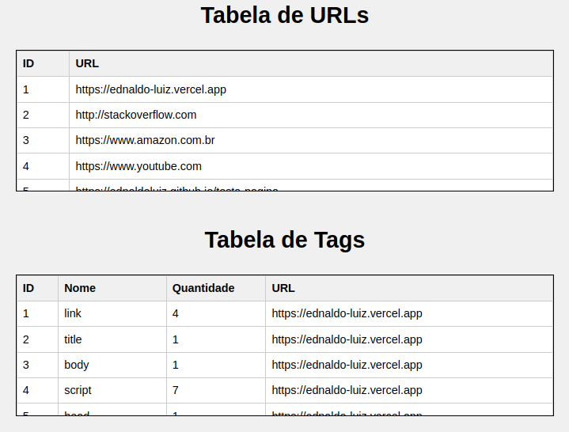
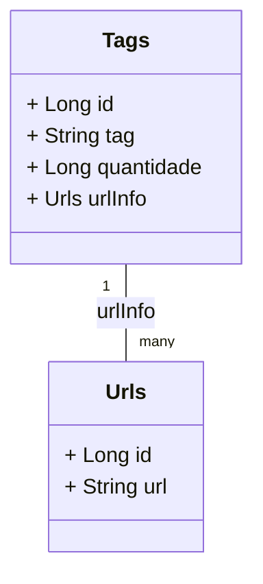

<h1 align="center"> Nuti-desafio-tags</h1>

<div align="center">
  
</div>

<h2>:computer: Visao geral do Projeto:</h2>

 <table>
    <thead>
        <tr>
            <th align="center">
                 
                <p align="center"><small>Nome</small></p>
            </th>
            <th align="center">
                 
                <p align="center"><small>Descrição</small></p>
            </th>
            <th align="left">
                
                <p align="center"><small>Imagem</small></p>
            </th>
        </tr>
    </thead>
    <tbody>
        <tr>
            <td align="center">:page_facing_up: Formulario de busca:</td>
            <td>Campo de entrada do usuário para buscar tags com base na URL fornecida.</td>
            <td align="center">
            	
	    </td>
        </tr>
        <tr>
            <td align="center">:bar_chart: Tabela com todos registros do MySQL</td>
            <td>Tabelas de URLs e Tags com os dados existentes no banco de dados.</td>
            <td align="center">
           	
	    </td>
        </tr>
	<tr>
            <td align="center">:x: URL passada incorretamente:</td>
            <td>Caso a URL passada seja inexistente.</td>
            <td align="center">
           	
	    </td>
        </tr>
	<tr>
            <td align="center">:bar_chart: Tabela de resultados: </td>
            <td>Tabela com o resultado retornado da pesquisa passada no campo de busca.</td>
            <td align="center">
           	
	    </td>
        </tr>
    </tbody>
</table>

<h2>:bangbang: Problema</h2>
<ul>
	<li>No código de uma página HTML há diversas tags para apresentar o conteúdo da melhor forma.</li>
	<li>Para uma análise mais cautelosa, há o interesse de contabilizar a quantidade de cada tag HTML em uma determinada página.</li>
	<li>É necessário criar um programa para identificar as tags HTML existentes nas páginas que forem carregadas por meio da URL informada.</li>
	<li>Deve ser contado quantas vezes cada tag aparece em cada página.</li>
	<li>É necessário mostrar as informações coletadas para possibilitar verificar os dados da URL informada.</li>
	<li>Assim, as URL, tags e as respectivas contagens devem ser armazenadas em um banco de dados.</li>
</ul>

<h2>:clipboard: Exemplo: </h2>

```html
<html>
   <head>
      <title>Teste prático</title>
   </head>
   <body>
      <h1>Olá</h1>
      <p>Teste 1</p>
      <p>Teste 2</p>
      <p>Teste 3</p>
   </body>
</html>
```
<h2>:white_check_mark: Resultado: </h2>

<div align="center">
<table border="1">
    <thead>
      <tr>
        <th>Tag</th>
        <th>Quantidade</th>
      </tr>
    </thead>
    <tbody>
      <tr>
        <td>html</td>
        <td>1</td>
      </tr>
      <tr>
        <td>head</td>
        <td>1</td>
      </tr>
      <tr>
        <td>title</td>
        <td>1</td>
      </tr>
      <tr>
        <td>body</td>
        <td>1</td>
      </tr>
      <tr>
        <td>h1</td>
        <td>1</td>
      </tr>
      <tr>
        <td>p</td>
        <td>3</td>
      </tr>
    </tbody>
  </table>
</div>
  
<h2>:memo: Diagrama de Classes:</h2>



<h2>:dolphin: Código MySQL:</h2>
<h3> :memo: Tabela de urls: </h3>

```sql
CREATE TABLE tb_urls (
  id BIGINT AUTO_INCREMENT PRIMARY KEY,
  url VARCHAR(255) NOT NULL
);
```

<h3>:memo: Tabela de tags: </h3>

```sql
CREATE TABLE tb_tags (
  id BIGINT AUTO_INCREMENT PRIMARY KEY,
  tag VARCHAR(255) NOT NULL,
  quantidade BIGINT,
  url_info_id BIGINT,
  FOREIGN KEY (url_info_id) REFERENCES tb_urls(id)
);
```

<h2>:books: Principais Bibliotecas para a Solução:</h2>

### JSoup
- Bilioteca usada para extrair a quantidade de tags e seus respectivos nomes das URLs informadas

```xml
<dependency>
	<groupId>org.jsoup</groupId>
	<artifactId>jsoup</artifactId>
	<version>1.16.1</version>
</dependency>
```

### Flyway
- Bilioteca usada para criar as tabelas do banco de dados dentro da pasta db/migration
```xml
<dependency>
    <groupId>org.flywaydb</groupId>
    <artifactId>flyway-core</artifactId>
</dependency>

<dependency>
    <groupId>org.flywaydb</groupId>
    <artifactId>flyway-mysql</artifactId>
</dependency>
```
### MySQL-connector
- Bilioteca usada para conectar o projeto ao MySQL

```xml
<dependency>
	<groupId>mysql</groupId>
	<artifactId>mysql-connector-java</artifactId>
	<version>8.0.33</version>
</dependency>
```

### JPA
- Bilioteca usada para utilizar as interfaces e anotações ajudando a manipular os dados

```xml
<dependency>
    <groupId>org.springframework.boot</groupId>
    <artifactId>spring-boot-starter-data-jpa</artifactId>
</dependency>
```
### Thymeleaf
  - Bilioteca usada para integrar as respostas do controller em páginas html

```xml
<dependency>
	<groupId>org.springframework.boot</groupId>
	<artifactId>spring-boot-starter-thymeleaf</artifactId>
</dependency>
```
## :wrench: Tech Stack utilizada:
<div align="center">
    
</div>


